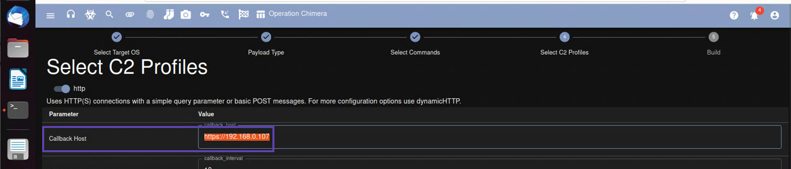
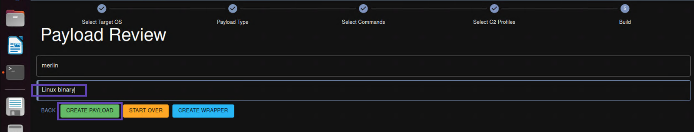
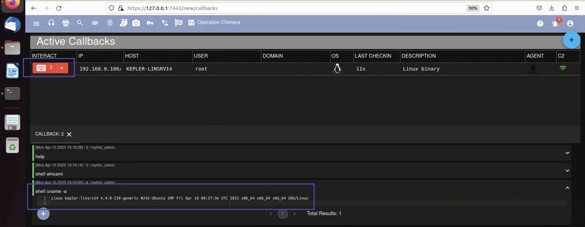

+++
title = "Merlin Agent"
weight = 6
+++

At the risk of sounding overly opinionated, I think the merlin payload is one of the best Linux/Unix compatible c2 
implants you can find.  Here is how to create a new one from within the Mythic web UI.  Alternativly, here is a link 
you could follow for generating a merlin agent using the command line tool.

## Creating a merlin agent for Linux
[Building a custom merlin agent](https://merlin-c2.readthedocs.io/en/latest/agent/custom.html)

* Navigate to the */new/payloads* path and select **Generate New Payload*** from the ACTIONS drop down menu

* Select a target operating system which in this case is going to be **Linux**

* On the next screen *Select Target Payload Type* simply accept the default and click **Next**
* On the next screen *Build Commands Into Agent* simply accept the defaults and click **Next**
* Check the radio dial next to **http** and update the *Callback Host* parameter to match the IP address of your Ubuntu VM

* Accept the rest of the defaults and click **Next**
* Type any notes you want in the Description section and click **CREATE PAYLOAD**

This will queue your payload for building and you can check the progress by acecssing */new/payloads*.  When your payload 
is finished being built it will have a green arrow icon under the Download column in the Payloads table.  Download the 
payload so we can try and deploy it on our compromised Linux server.

## Deploying merlin on a compromised Linux host
Since we already have a root user with SSH access, deploying this merlin agent is going to be really simple.

* First use **scp** to transfer the merlin binary to the realhax user's home directory (/root)
  *  `scp merlin realhax@192.168.0.106:`
* Then SSH into the host
  *  `ssh realhax@192.168.0.106`
* Change the permissions on the binary so that it is executable and run it in the background
  *  `chmod 755 merlin`
  *  `./merlin &`

On the callbacks page you can interact with a particular merlin agent by clicking on the keyboard looking icon and then issuing 
a command merlin knows how to understand.  Try issuing `shell uname -a`

