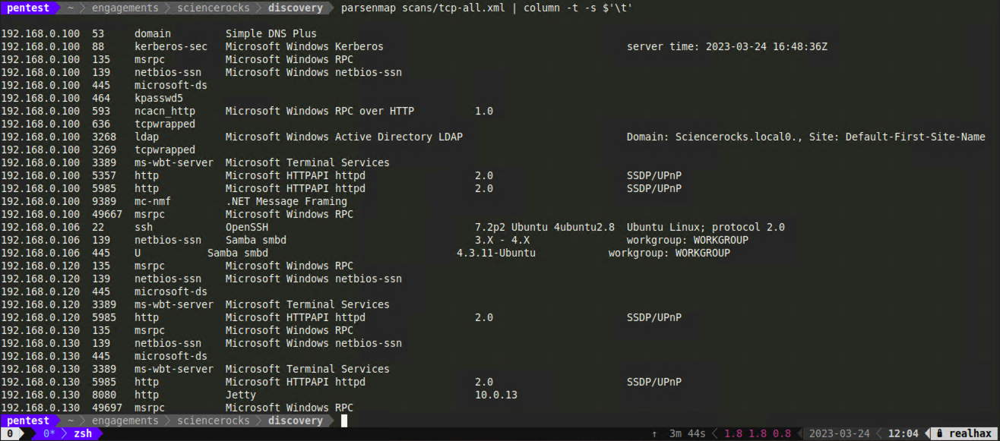

+++
title = "Discovering Services with Nmap"
menuTitle = "Nmap once again"
weight = 30
+++


## 1. Common TCP Ports
Sometimes you have to perform service discovery against so many assets that it makes sense to first scan the most common ports.
Nmap has a flag specifically for this use case *--top-ports [number]*.

```bash
nmap -Pn -n -sV -iL targets.txt --top-ports 25 -oA scans/tcp-common 
```

* **--top-ports:**
  * Scan [number] most common ports
* **-sV:**
  * Probe open ports to determine service/version info

This will scan the following 25 ports against all IP addresses in the *targets.txt* file.  These 25 ports, according to Nmap are the 25 most commonly used ports.

```
TCP(25;21-23,25,53,80,110-111,135,139,143,199,443,445,587,993,995,1025,1720,1723,3306,3389,5900,8080,8888)
```


### 1.1. Commonly Attacked Ports

The above 25 ports may be the most commonly used but they aren't necessarily the most commonly attacked.  Meaning there might be a better list of ports to use for a quick scan.
You'll develop your own list of favorites as you conduct more engagements.  For now, I give you my own.

```bash
export MYPORTS='21-23,25,53,80-85,389,443,445,636,1433,3000,3306,3389,5800,5900,7443,8080,8443,8888'
nmap -Pn -n -sV -iL targets.txt -p $MYPORTS -oA scans/tcp-fav 
```

## 2. All TCP Ports
This scan can take a while but will check for all 65k+ ports and often identify *weird* services or maybe normal services listening on *non-standard* ports.  
*H.D. Moore* once told me that the "magic" number is 50,000.  That's the true maximum number of packets per second that Nmap can send due to old school C style TCP socket programming.
```bash
nmap -Pn -n -sV -A -iL targets.txt -p 1-65535 -oA scans/tcp-all -v --min-rate 5000 -T4
```

* **-T<0-5>:**
  * Set timing template (higher is faster)
* **--min-rate 500:**
  * Scan 500 ports at a time on each of the 100 hosts
* **-A:**
  * Enable OS detection, version detection, script scanning, and traceroute
* **-v:**
  * Increase verbosity level (use -vv or more for greater effect)

## 3. Parsenmap Gem
There is a lot of great information stored within all three *.nmap*, *.gnmap*, and *.xml* files. 
For a quick and dirty overview of just open ports and services I recommend the *parsenmap* Ruby gem

```bash
parsenmap scans/tcp-all.xml | column -t -s $'\t'
```



### 3.1 Protocol-specific Target Lists
Here's a secret sauce *#protip*.  It's a good idea to split out your IP address list into protocol groupings.
For example you can create a file called `hosts/windows.txt` containing the IP addresses of hosts with port *445* open.  
Or a file called `hosts/mssql.txt` for every host with port *1433* open.
What this does is allow you to feed these files as input into other tools which you'll use to test for protocol specific attack vectors later on.

```bash
parsenmap scans/tcp-all.xml | grep 445 | cut -f1 | sort -u > hosts/windows.txt
```
