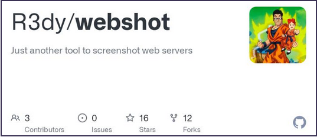
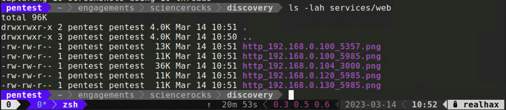
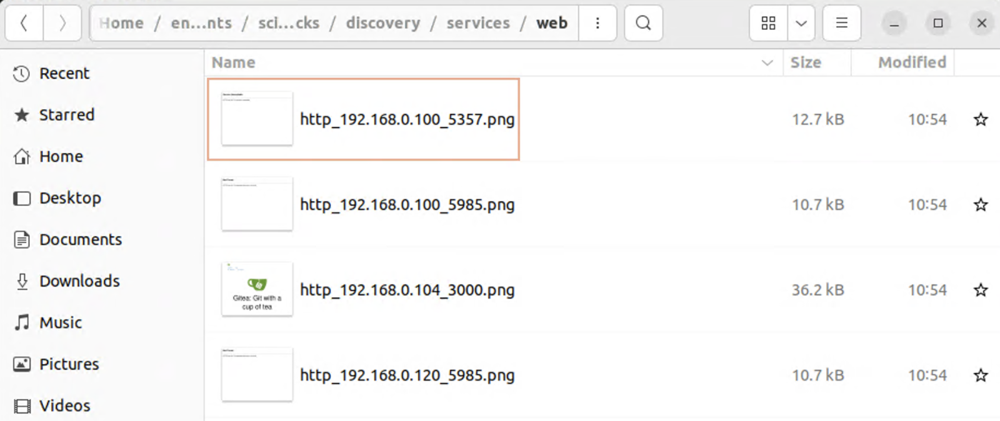

+++
title = "Screen Grabbing Web Servers in Bulk"
menuTitle = "Webshot"
weight = 40
+++



## 1. Browsing lots of web servers quickly
On a typical netpen engagement you could see hundreds maybe thousands of *HTTP/S* servers in your nmap discovery.
While your scope likely won't include full blown web penetration testing, these services shouldn't be ignored.
Often times you'll discover a common web application with known weaknesses or attack vectors which can be leveraged 
to gain your initial foothold.

Of course typing the IP addresses one by one in your browser isn't practical at at large scale.  For this reaon, 
several tools have been created to take in a list of URLs or IP addresses and take a screenshot at the web root.
I happen to have created such a tool so that's the one we'll use in this course.  I'll offer some unbiased links 
to alternative tools at the end of this section should you wish to explore other options.

### 1.1 Basic Usage
Webshot takes in a *.xml* Nmap file, parses out what it recoginses as an HTTP/S service and then attempts to 
take a screenshot of the returned page using a Ruby library called [IMGKit](https://github.com/csquared/IMGKit)

`/opt/webshot/webshot.rb -t scans/tcp-all.xml -o services/web`

```bash
Extracting URLs from Nmap scan
Configuring IMGKit options
Capturing 5 screenshots using 10 threads
```



Now you can simply open up a file browser and switch the view to icons to conviently scroll through the output 
generated by webshot.  This way you can easily skip over blank or uninteresting pages and identify more interesting 
targets.  There seems to be something interesting at *http://192.168.0.104:3000*.


