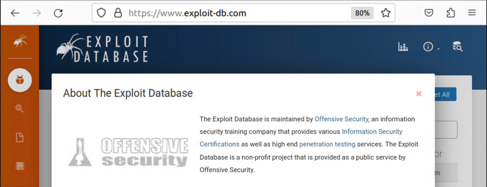
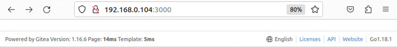
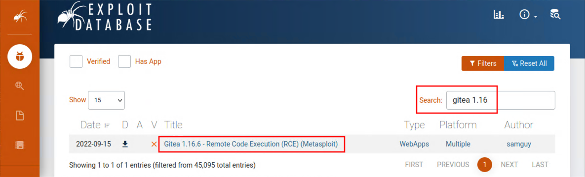
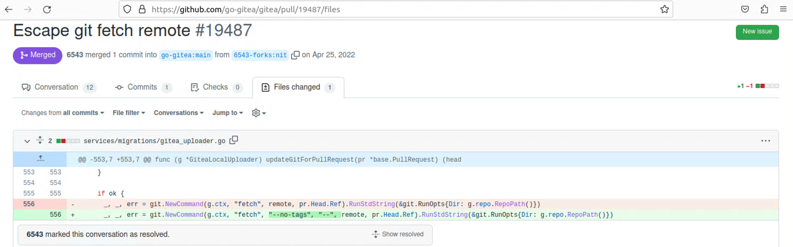

+++
title = "Exploit Database"
menuTitle = "exploit-db"
weight = 70
+++

## 1. Version based discovery
One of the main reasons we try to enumerate specific software versions is so that we can cross reference with public databases like 
exploit-db.com.

You may recall from service discovery that we identified a Gitea server located at *http://192.168.0.130:3000*.

This particular web server is kind enough to tell us the exact version that it's running *1.16.6*. We can type this directly into the 
exploit-db search to see if we get any hits.

Cool!  If we open up this exploit on *exploit-db.com* we can see that its taking advantage of *CVE-2022-30781*.

* [https://nvd.nist.gov/vuln/detail/CVE-2022-30781](https://nvd.nist.gov/vuln/detail/CVE-2022-30781)

Reading up a little bit on this CVE we can see that this version of Gitea is failing to escape remote URL fetching. Because Gitea 
is an open-source project we can easily check the commits to see which files were changed and how.

* [https://github.com/go-gitea/gitea/pull/19487/files](https://github.com/go-gitea/gitea/pull/19487/files)

