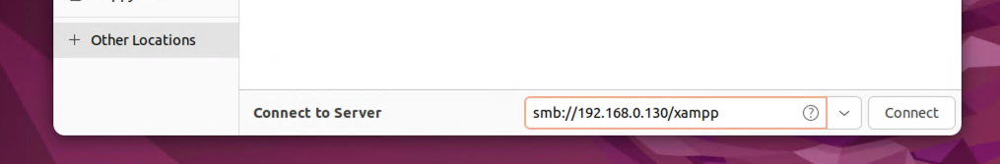
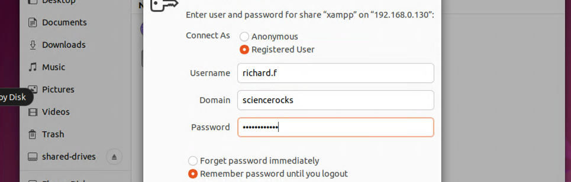
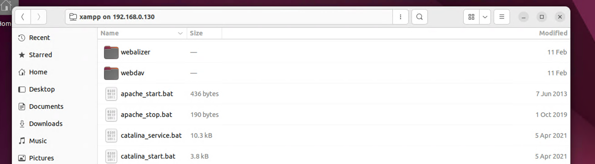

+++
title = "SMB Shares"
menuTitle = "SMB Shares"
weight = 60
+++


## 1. Accessing From Commandline
When in doubt, one of the quickest/easiest ways to connect to an SMB share is to use the *smbclient* commandline utility.

`smbclient --help`

```bash
Usage: smbclient [OPTIONS] service <password>
  -M, --message=HOST                           Send message
  -I, --ip-address=IP                          Use this IP to connect to
  -E, --stderr                                 Write messages to stderr instead of stdout
  -L, --list=HOST                              Get a list of shares available on a host
  -T, --tar=<c|x>IXFvgbNan                     Command line tar
  -D, --directory=DIR                          Start from directory
  -c, --command=STRING                         Execute semicolon separated commands
  -b, --send-buffer=BYTES                      Changes the transmit/send buffer
  -t, --timeout=SECONDS                        Changes the per-operation timeout
  -p, --port=PORT                              Port to connect to
  -g, --grepable                               Produce grepable output
  -q, --quiet                                  Suppress help message
  -B, --browse                                 Browse SMB servers using DNS

Help options:
  -?, --help                                   Show this help message
      --usage                                  Display brief usage message

Common Samba options:
  -d, --debuglevel=DEBUGLEVEL                  Set debug level
      --debug-stdout                           Send debug output to standard output
  -s, --configfile=CONFIGFILE                  Use alternative configuration file
      --option=name=value                      Set smb.conf option from command line
  -l, --log-basename=LOGFILEBASE               Basename for log/debug files
      --leak-report                            enable talloc leak reporting on exit
      --leak-report-full                       enable full talloc leak reporting on exit

Connection options:
  -R, --name-resolve=NAME-RESOLVE-ORDER        Use these name resolution services only
  -O, --socket-options=SOCKETOPTIONS           socket options to use
  -m, --max-protocol=MAXPROTOCOL               Set max protocol level
  -n, --netbiosname=NETBIOSNAME                Primary netbios name
      --netbios-scope=SCOPE                    Use this Netbios scope
  -W, --workgroup=WORKGROUP                    Set the workgroup name
      --realm=REALM                            Set the realm name

Credential options:
  -U, --user=[DOMAIN/]USERNAME[%PASSWORD]      Set the network username
  -N, --no-pass                                Do not ask for a password
      --password=STRING                        Password
      --pw-nt-hash                             The supplied password is the NT hash
  -A, --authentication-file=FILE               Get the credentials from a file
  -P, --machine-pass                           Use stored machine account password
      --simple-bind-dn=DN                      DN to use for a simple bind
      --use-kerberos=desired|required|off      Use Kerberos authentication
      --use-krb5-ccache=CCACHE                 Credentials cache location for Kerberos
      --use-winbind-ccache                     Use the winbind ccache for authentication
      --client-protection=sign|encrypt|off     Configure used protection for client
                                               connections

Deprecated legcacy options:
  -k, --kerberos                               DEPRECATED: Migrate to --use-kerberos

Version options:
  -V, --version                                Print version
```

### 1.1 Basic Usage
To connect to an SMB share use the following command:

`smbclient '\\192.168.0.130\xamp' -U 'sciencerocks\richard.f' -p`

```bash
Password for [SCIENCEROCKS\richard.f]:
Try "help" to get a list of possible commands.
smb: \> dir
  .                                   D        0  Wed Mar 15 15:01:51 2023
  ..                                  D        0  Mon Feb 20 11:59:07 2023
  anonymous                           D        0  Sat Feb 11 14:59:03 2023
  apache                              D        0  Sat Feb 11 14:59:17 2023
  apache_start.bat                    A      436  Fri Jun  7 06:15:44 2013
  apache_stop.bat                     A      190  Tue Oct  1 02:13:32 2019
  catalina_service.bat                A    10324  Mon Apr  5 11:16:20 2021
  catalina_start.bat                  A     3766  Mon Apr  5 11:17:38 2021
  catalina_stop.bat                   A     3529  Mon Apr  5 11:17:35 2021
  cgi-bin                             D        0  Sat Feb 11 15:05:20 2023
  contrib                             D        0  Sat Feb 11 14:58:56 2023
  ctlscript.bat                       A     3499  Sat Feb 11 14:58:50 2023
  FileZillaFTP                        D        0  Sat Feb 11 15:05:18 2023
  filezilla_setup.bat                 A       78  Sat Mar 30 07:29:00 2013
  filezilla_start.bat                 A      150  Fri Jun  7 06:15:48 2013
  filezilla_stop.bat                  A      149  Fri Jun  7 06:15:48 2013
  htdocs                              D        0  Sat Feb 11 14:59:03 2023
  img                                 D        0  Sat Feb 11 14:58:50 2023
  install                             D        0  Sat Feb 11 15:05:17 2023
  killprocess.bat                     A      299  Wed Jun 15 11:07:39 2022
  licenses                            D        0  Sat Feb 11 14:58:52 2023
  locale                              D        0  Sat Feb 11 14:58:52 2023
  mailoutput                          D        0  Sat Feb 11 14:58:52 2023
  mailtodisk                          D        0  Sat Feb 11 14:59:14 2023
  MercuryMail                         D        0  Sat Feb 11 15:05:18 2023
  mercury_start.bat                   A      136  Fri Jun  7 06:15:48 2013
  mercury_stop.bat                    A       60  Fri Jun  7 06:15:48 2013
  mysql                               D        0  Sat Feb 11 14:59:40 2023
  mysql_start.bat                     A      471  Mon Jun  3 06:39:00 2019
  mysql_stop.bat                      A      270  Tue Oct  1 02:13:56 2019
  passwords.txt                       A      824  Mon Mar 13 06:04:44 2017
  perl                                D        0  Sat Feb 11 15:01:21 2023
  php                                 D        0  Sat Feb 11 15:05:20 2023
  phpMyAdmin                          D        0  Sat Feb 11 15:04:15 2023
  properties.ini                      A      951  Sat Feb 11 15:04:19 2023
  readme_de.txt                       A     7496  Thu Dec 29 12:57:59 2022
  readme_en.txt                       A     7366  Thu Dec 29 12:57:59 2022
  sendmail                            D        0  Sat Feb 11 15:04:17 2023
  service.exe                         A    60928  Sat Mar 30 07:29:00 2013
  setup_xampp.bat                     A     1255  Sat Mar 30 07:29:00 2013
  src                                 D        0  Sat Feb 11 14:58:52 2023
  test_php.bat                        A     1671  Sun Nov 29 07:38:37 2020
  tmp                                 D        0  Sat Feb 11 14:58:56 2023
  tomcat                              D        0  Sat Feb 11 15:00:09 2023
  uninstall.dat                       A   264055  Sat Feb 11 15:05:54 2023
  uninstall.exe                       A  6579464  Sat Feb 11 15:05:54 2023
  webalizer                           D        0  Sat Feb 11 15:05:20 2023
  webdav                              D        0  Sat Feb 11 14:59:14 2023
  xampp-control.exe                   A  3368448  Tue Apr  6 06:38:27 2021
  xampp-control.ini                   A     1195  Sat Feb 11 15:13:01 2023
  xampp-control.log                   A     2153  Sat Feb 11 15:15:17 2023
  xampp_shell.bat                     A     1084  Sat Feb 11 14:59:14 2023
  xampp_start.exe                     A   118784  Sat Mar 30 07:29:00 2013
  xampp_stop.exe                      A   118784  Sat Mar 30 07:29:00 2013
```

Form here you can use FTP style *get* and *put* commands to download or upload files to/from the share.

## 2. GUI File Browser
Most GUI file browsers have a built in capability to connect to an smb share with something like *smb://[ip address]*.  Open up the Ubuntu file browser 
and click on *+ Other Locations* from the left navigation. Then type in *smb://192.168.0.130/xampp* and click Connect.



Enter the Active Directory user credentials



Now you can see the files in the share as if they were located on your own machine.



## 3. Enumerating SMB Shares
Now that we know we have valid AD credentials one of the next things we should do is take a look at any SMB shares we have access to to see if there is anything we can compromise.

`crackmapexec smb hosts/windows.txt -u richard.f -p "Security24-7" --shares`

```bash
SMB         192.168.0.120   445    HAWKINGWINSRV19  [+] Sciencerocks.local\richard.f:Security24-7 
SMB         192.168.0.120   445    HAWKINGWINSRV19  [+] Enumerated shares
SMB         192.168.0.130   445    FEYNMAN-WINSRV1  [+] Sciencerocks.local\richard.f:Security24-7 
SMB         192.168.0.120   445    HAWKINGWINSRV19  Share           Permissions     Remark
SMB         192.168.0.120   445    HAWKINGWINSRV19  -----           -----------     ------
SMB         192.168.0.120   445    HAWKINGWINSRV19  ADMIN$                          Remote Admin
SMB         192.168.0.120   445    HAWKINGWINSRV19  C$                              Default share
SMB         192.168.0.120   445    HAWKINGWINSRV19  IPC$            READ            Remote IPC
SMB         192.168.0.100   445    EINSTEIN-DC01    [+] Sciencerocks.local\richard.f:Security24-7 
SMB         192.168.0.104   445    KEPLER-LINSRV14  [+] \richard.f:Security24-7 
SMB         192.168.0.104   445    KEPLER-LINSRV14  [+] Enumerated shares
SMB         192.168.0.104   445    KEPLER-LINSRV14  Share           Permissions     Remark
SMB         192.168.0.104   445    KEPLER-LINSRV14  -----           -----------     ------
SMB         192.168.0.104   445    KEPLER-LINSRV14  print$                          Printer Drivers
SMB         192.168.0.104   445    KEPLER-LINSRV14  IPC$                            IPC Service (kepler-linsrv14 server (Samba, Ubuntu))
SMB         192.168.0.130   445    FEYNMAN-WINSRV1  [+] Enumerated shares
SMB         192.168.0.130   445    FEYNMAN-WINSRV1  Share           Permissions     Remark
SMB         192.168.0.130   445    FEYNMAN-WINSRV1  -----           -----------     ------
SMB         192.168.0.130   445    FEYNMAN-WINSRV1  ADMIN$                          Remote Admin
SMB         192.168.0.130   445    FEYNMAN-WINSRV1  C$                              Default share
SMB         192.168.0.130   445    FEYNMAN-WINSRV1  IPC$            READ            Remote IPC
SMB         192.168.0.130   445    FEYNMAN-WINSRV1  Users           READ            
SMB         192.168.0.130   445    FEYNMAN-WINSRV1  xampp           READ,WRITE      
SMB         192.168.0.100   445    EINSTEIN-DC01    [+] Enumerated shares
SMB         192.168.0.100   445    EINSTEIN-DC01    Share           Permissions     Remark
SMB         192.168.0.100   445    EINSTEIN-DC01    -----           -----------     ------
SMB         192.168.0.100   445    EINSTEIN-DC01    ADMIN$                          Remote Admin
SMB         192.168.0.100   445    EINSTEIN-DC01    C$                              Default share
SMB         192.168.0.100   445    EINSTEIN-DC01    IPC$            READ            Remote IPC
SMB         192.168.0.100   445    EINSTEIN-DC01    NETLOGON        READ            Logon server share 
SMB         192.168.0.100   445    EINSTEIN-DC01    SYSVOL          READ            Logon server share
```

Take note of the *xampp* share which our compromised user account has both READ and WRITE access to! 

### 3.1. Spidering SMB Shares
We can also use CrackMapExec to spider though 
a particular share searching for interesting filenames.  For example:

`cme smb 192.168.0.130 -u richard.f -p Security24-7 --spider xampp --pattern passw`
```bash
SMB         192.168.0.130   445    FEYNMAN-WINSRV1  [*] Started spidering
SMB         192.168.0.130   445    FEYNMAN-WINSRV1  [*] Spidering .
SMB         192.168.0.130   445    FEYNMAN-WINSRV1  //192.168.0.130/xampp/passwords.txt [lastm:'2023-03-11 13:07' size:824]
SMB         192.168.0.130   445    FEYNMAN-WINSRV1  //192.168.0.130/xampp/apache/bin/htpasswd.exe [lastm:'2023-03-11 13:07' size:119296]
SMB         192.168.0.130   445    FEYNMAN-WINSRV1  //192.168.0.130/xampp/htdocs/dashboard/docs/reset-mysql-password.html [lastm:'2023-03-11 13:07' size:6476]
SMB         192.168.0.130   445    FEYNMAN-WINSRV1  //192.168.0.130/xampp/htdocs/dashboard/docs/reset-mysql-password.pdf [lastm:'2023-03-11 13:07' size:61387]
SMB         192.168.0.130   445    FEYNMAN-WINSRV1  //192.168.0.130/xampp/htdocs/dashboard/docs/reset-mysql-password.pdfmarks [lastm:'2023-03-11 13:07' size:215]
SMB         192.168.0.130   445    FEYNMAN-WINSRV1  //192.168.0.130/xampp/htdocs/dashboard/docs/images/reset-mysql-password [dir]
SMB         192.168.0.130   445    FEYNMAN-WINSRV1  //192.168.0.130/xampp/MercuryMail/MAIL/Admin/PASSWD.PM [lastm:'2023-03-11 13:07' size:66]
SMB         192.168.0.130   445    FEYNMAN-WINSRV1  //192.168.0.130/xampp/MercuryMail/MAIL/newuser/PASSWD.PM [lastm:'2023-03-11 13:07' size:71]
SMB         192.168.0.130   445    FEYNMAN-WINSRV1  //192.168.0.130/xampp/MercuryMail/MAIL/postmaster/PASSWD.PM [lastm:'2023-03-11 13:07' size:66]
SMB         192.168.0.130   445    FEYNMAN-WINSRV1  //192.168.0.130/xampp/php/pear/File/Passwd [dir]
SMB         192.168.0.130   445    FEYNMAN-WINSRV1  //192.168.0.130/xampp/php/pear/File/Passwd.php [lastm:'2023-03-11 13:07' size:13548]
SMB         192.168.0.130   445    FEYNMAN-WINSRV1  //192.168.0.130/xampp/phpMyAdmin/libraries/classes/UserPassword.php [lastm:'2023-03-11 13:07' size:7024]
SMB         192.168.0.130   445    FEYNMAN-WINSRV1  //192.168.0.130/xampp/phpMyAdmin/libraries/classes/Controllers/UserPasswordController.php [lastm:'2023-03-11 13:07' size:3379]
SMB         192.168.0.130   445    FEYNMAN-WINSRV1  //192.168.0.130/xampp/phpMyAdmin/templates/user_password.twig [lastm:'2023-03-11 13:07' size:83]
SMB         192.168.0.130   445    FEYNMAN-WINSRV1  //192.168.0.130/xampp/phpMyAdmin/templates/server/privileges/change_password.twig [lastm:'2023-03-11 13:07' size:3401]
SMB         192.168.0.130   445    FEYNMAN-WINSRV1  //192.168.0.130/xampp/phpMyAdmin/themes/bootstrap/img/password.svg [lastm:'2023-03-11 13:07' size:342]
SMB         192.168.0.130   445    FEYNMAN-WINSRV1  //192.168.0.130/xampp/phpMyAdmin/themes/metro/img/s_passwd.png [lastm:'2023-03-11 13:07' size:1034]
SMB         192.168.0.130   445    FEYNMAN-WINSRV1  //192.168.0.130/xampp/phpMyAdmin/themes/original/img/s_passwd.png [lastm:'2023-03-11 13:07' size:331]
SMB         192.168.0.130   445    FEYNMAN-WINSRV1  //192.168.0.130/xampp/phpMyAdmin/themes/pmahomme/img/s_passwd.png [lastm:'2023-03-11 13:07' size:331]
SMB         192.168.0.130   445    FEYNMAN-WINSRV1  [*] Done spidering (Completed in 149.30476093292236)
```

