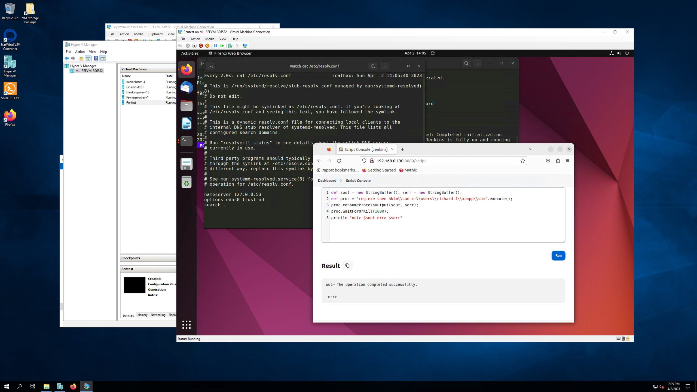
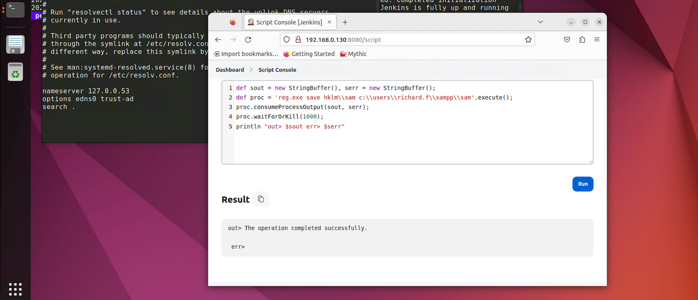
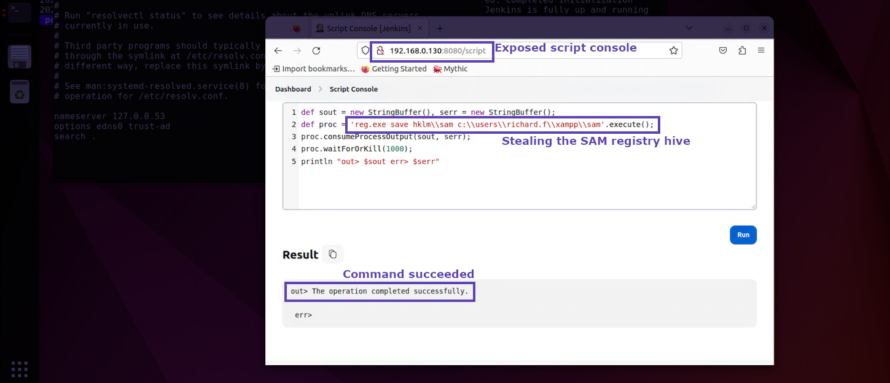

+++
title = "Screenshots"
weight = 5
+++

#### Good
All of the important information is present, the question is where should I be looking?

#### Better
OK this is much better, I see a more specific focus.  It looks like a Jenkins server and some code being executed.  Still what exactly are you trying to 
draw my attention towards?

#### Best
Now this screenshot is perfect!  It's removed everything that doesn't matter and even draw boxes with labels around the specific details being called out.

