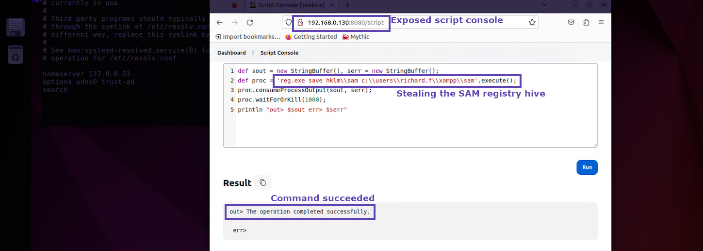

+++
title = "Screenshots"
weight = 5
+++

#### Good
All of the important information is present, the question is where should I be looking?

#### Better
OK this is much better, I see a more specific focus.  It looks like a Jenkins server and some code being executed.  Still what exactly are you trying to 
draw my attention towards?

#### Best
Now this screenshot is perfect!  It's removed everything that doesn't matter and even draw boxes with labels around the specific details being called out.

*Note:* Some would argue the darkened screen around the bright Jenkins server is unecessary and I wouldn't hold that 
against you if you agree with them.  I personally  prefer wider landscape screenshots because they render nicley 
in word documents as apposed to taller or square ones.  

