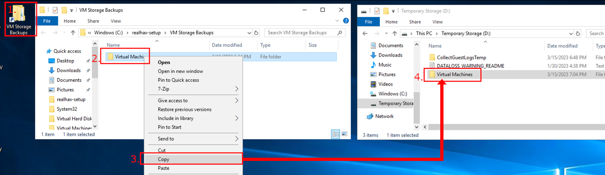
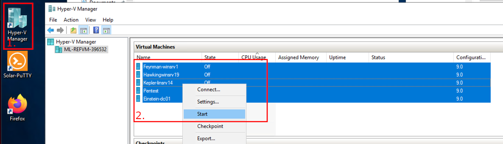

+++
title = "Accessing the Lab"
weight = 11
+++

## Before Booting the VMs
Hyper-V VMs take up a lot of diskspace.  Your lab VM has a temporary storage drive which gets wipped after every reboot.  To save space on your C:\ 
I've told Hyper-V to store sate files on this Temporary Storage partition and then placed backups on the C:\ partition.  If this doesn't make any sense 
don't worry about it, just follow the image below to copy over the files so your VMs will boot.

1. Open up the *VM Storage Backups* folder located on your Desktop
2. Right+click on the *Virtual Machines* folder
3. Select *Copy* form the menu
4. Paste the *Virtual Machines* folder at the root of the *Temporary Storage (D:)* partition

## Booting the VMs
Use the Hyper-V Manager to start up the lab virtual machines.

1. Open the Hyper-V Manager using the shortcut on your Desktop
2. Highlight all of the VMs, right+click and select *Start*

*Corection!*
First start **Einstein-dc01**, wait 20 seconds or so, then start the remaining four VMs.
