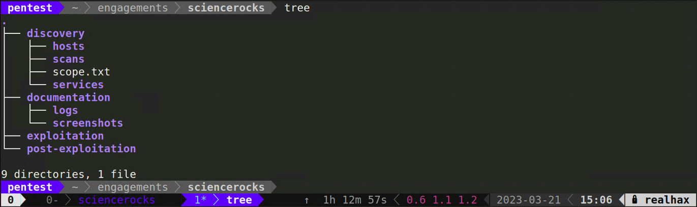

+++
title = "Preflight Checklist"
weight = 20
+++

Create the following directory structure within your Ubuntu *pentest* VM.

* **~/engagements**
  * **/sciencerocks**
    * **/discovery**
      * **/hosts**
      * **/scans**
      * **scope.txt**
      * **/services**
    * **/documentation**
    * **/exploitation**
    * **/post-exploitation**
