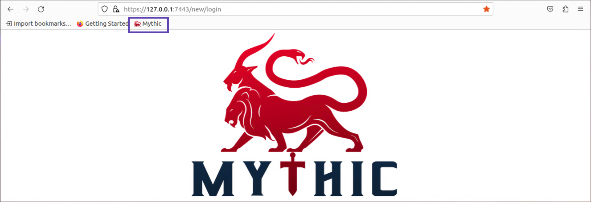
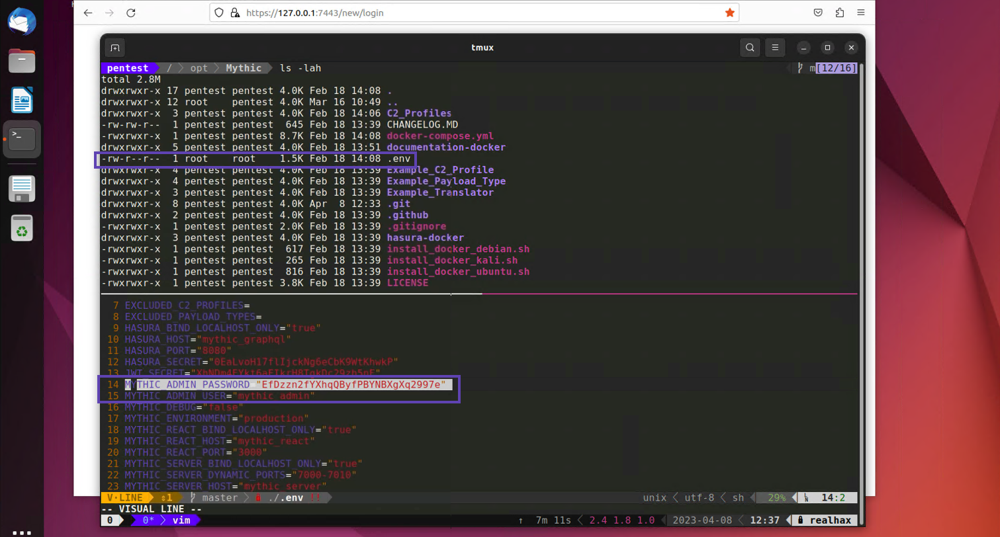
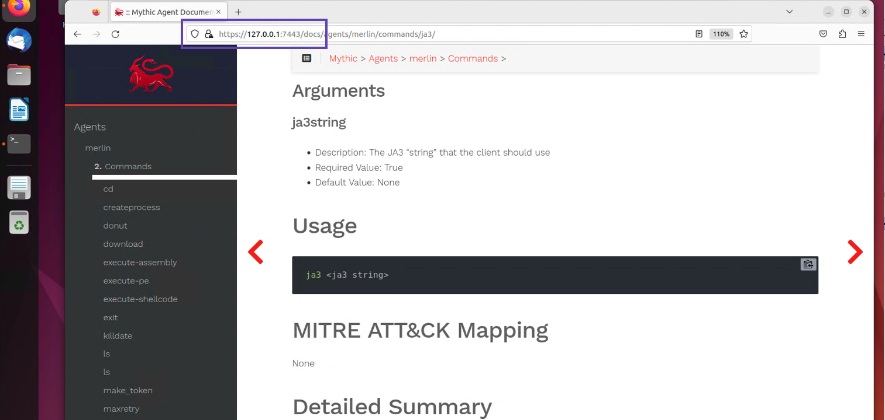
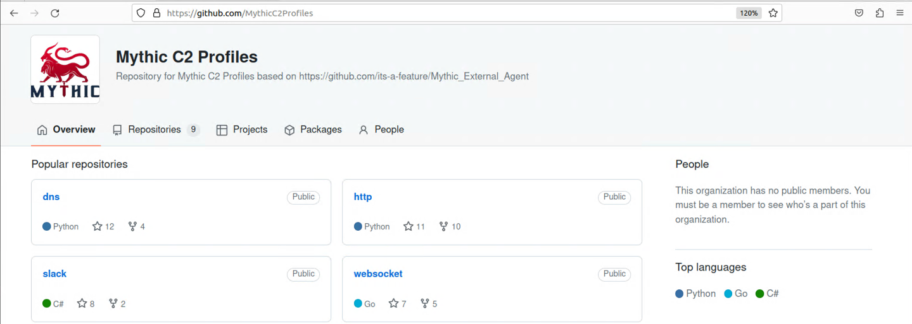
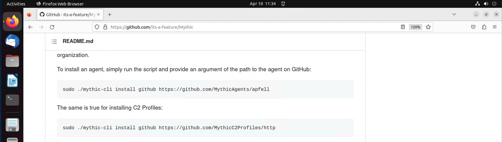
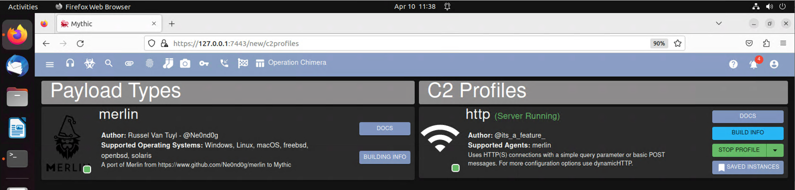

+++
title = "Mythic C2 Framework"
weight = 4
+++

The credentials used to access the Mythic web UI are located inside the */opt/Mythic/.env* file.

The hugo documentation is pretty good and can be accessed from your localhost. There is also additional documentation 
on the public GitBook.

* [https://127.0.0.1:7443/docs](https://127.0.0.1:7443/docs)
* [https://docs.mythic-c2.net](https://docs.mythic-c2.net)

## Mythic C2 Profiles
Mythic supports a wide array of what the team calls C2 Profiles.  You can refer to the official documentation for a proper 
explination but these are essentially different handlers.  Each one capable of recieving call backs from and interacting 
with different types of agents or payloads.

You can install individual C2 profiles using the *mythic-cli* tool located in the */opt/Mythic* directory.

You can see which C2 profiles as well as which payloads you have installed by visitng the */new/c2profiles* path on 
your localhost mythic server.

Let's create a new merlin binary and see if we can deploy it on our compromised Linux host.
